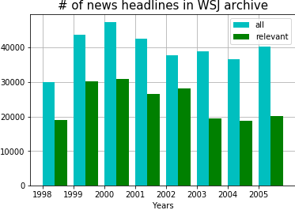

# WSJ_headlines_SP500
Investigate relation between sentiment of financial headlines and S&amp;P500 price movement

# Introduction

The archive of Wall Street Journal (WSJ) headlines (and articles) since 1998 is available at:

https://www.wsj.com/news/archive/years

The sentiment index is calculated for headlines relevant to finance/stock market. The relationship between the average sentiment index and S&P's price movement is investigated fro different time scales. Further the question is posed : Does the WSJ headline sentiment index have predictive power in so far as forecasting S&P's price movement is concerned.

The following shows the number of WSJ articles per year. The relevant articles are those with tags pertaining to finance/stock (eg. money, market, wealth, stock, business etc).

# Further work

* Collect archived news headlines from other sources which are relevant to S&P500
* Rather than considering only the headline, process the whole article and flesh out sentences relevant to S&P500.
