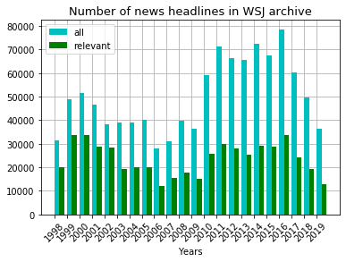
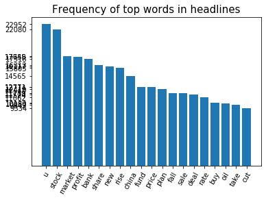
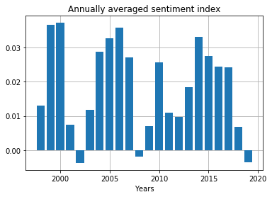
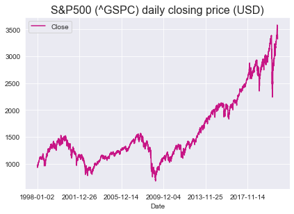
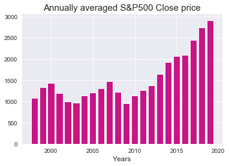
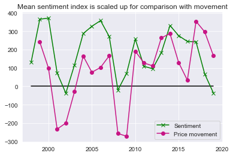
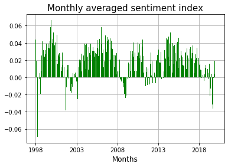
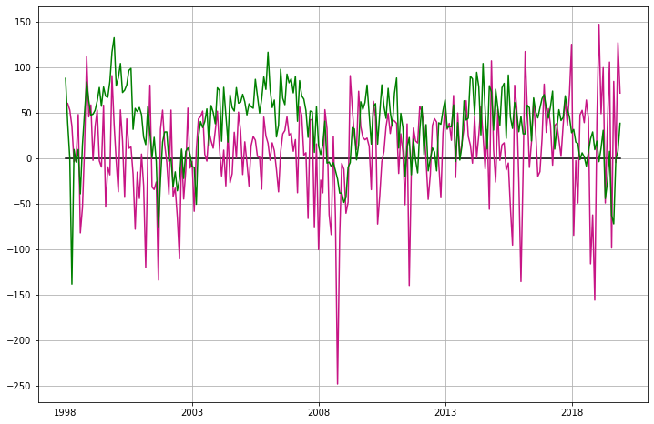

# WSJ_headlines_SP500
Investigate relation between sentiment of financial headlines and S&amp;P500 price movement

# Introduction

The archive of Wall Street Journal (WSJ) headlines (and articles) since 1998 is available at:

https://www.wsj.com/news/archive/years

The sentiment index is calculated for headlines relevant to finance/stock market. The relationship between the average sentiment index and S&P's price movement is investigated for different annual and monthly time scales. Further the question is posed : Does the WSJ headline sentiment index have predictive power in so far as forecasting S&P's price movement is concerned.

Packages used :
* Beautifulsoup
* Pandas

The following shows the number of WSJ articles per year. The relevant articles are those with tags (categories) pertaining to finance/stock (eg. money, market, wealth, stock, business etc).

The tags searched for to determine relevant headlines are :
'auto','bank','barron', 'business','capital','commod', 'commerce', 'corporate', 'earning','econom', 'energy', 'estate',
'exchange' , 'executive','finance', 'fiscal', 'forex' , 'fund','gas','goldman', 'heard', 'industr', 'infra', 'insur', 'invest', 'innovation',
'logistics','market','money','oil', 'price','property', 'share', 'stock', 'street', 'tax','tech', 'telecom',
'trade','treasur','value','venture','wealth','wall','worth'

The frequency of words in the relevant headlines are counted. The bar chart of top 10 words is,

Vader Sentiment analyser is used to calculate the sentiment score for each headline. This is annually averaged.

The following shows S&P500 index over same time period (1998-2020). Comparing the above sentiment index bar chart to the following figure it is clear that the negative sentiment in years 2002 and 2008 correlates strongly with the price drop around the same point in time.

   

The time varying S&P500 price is converted to price movement (i.e. gradient). The price movement is quantified by subtracting consecutive closing prices. The first entry corresponds to 1999 which is given by price(1999)-price(1998). The last entry corresponds to 2019 which is given by price(2019)-price(2018). 
There exists a strong correlation between the sentiment index and the price movement. However this correlation is between the sentiment and price of the same year. The key question is : __Does the sentiment index of a particular year correctly predict the movement for the next year ?__ One of the important predictions traders are interested in is whether the price increases or decreases in the future. They are also interested in the price in the future but minimally they are interested in knowing the movement which helps them to decide whether to go short or long in the stock. Apart from the sign of the gradient it is important to predict the magnitude of the gradient too. However in this work I have concentrated only on predicting the sign of the gradient (which though basic is a non-trivial problem).

 

I have setup a baseline prediction model which uses only the timeseries of movement. This baseline model uses persistence - the prediction is simply the current value. The persistence model for all its simplicity is very powerful in many timeseries prediction problems. A total number of 20 predictions are possible (2000-2019). The prediction for 2000 is +ve price movements since the sign of 1999 price movement is +ve. The value of 1999 price movement is +241.9. The prediction model only uses the sign. The prediction for 2000 turns out to be true. The baseline model prediction for 2001 turns out to be false.

The sentiment model uses the sentiment index for year N to predict the movement for year N+1. If the sentiment is -ve (+ve) for year N then the prediciton is -ve movement (+ve movement) for the year N+1. The following table summarizes the results. The sentiment model has a marginal advantage over the baseline model. The sentiment model correctly predicts one year for which the baseline model fails. This year happens to be 2010.

Confusion matrix (Baseline model) :

|Baseline |     |Pred|Pred |    | 
|:-------:|:---:|:--:|:--:|:--:|
|         |     | UP |DOWN|TOT | 
|**TRUE** |UP   | 13 |  2 |15  |
|**TRUE** |DOWN |  2 |  3 | 5  |

Confusion matrix (Sentiment model) :

|Sentiment|     |Pred|Pred|    | 
|:-------:|:---:|:--:|:--:|:--:|
|         |     | UP |DOWN|TOT | 
|**TRUE** |UP   | 15 |  0 |15  |
|**TRUE** |DOWN |  3 |  2 | 5  |

# Monthly timescale

 

 

# Further work

* Collect archived news headlines from other sources which are relevant to S&P500
* Rather than considering only the headline, process the whole article and flesh out sentences relevant to S&P500.

# References
https://towardsdatascience.com/stock-news-sentiment-analysis-with-python-193d4b4378d4

https://towardsdatascience.com/sentiment-analysis-of-stocks-from-financial-news-using-python-82ebdcefb638
