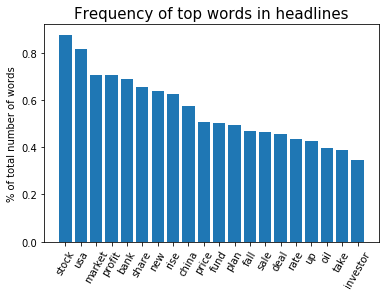
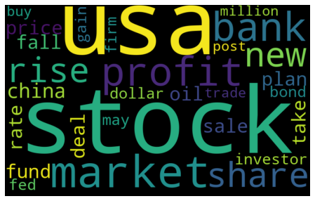
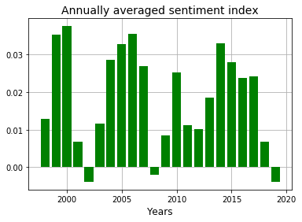
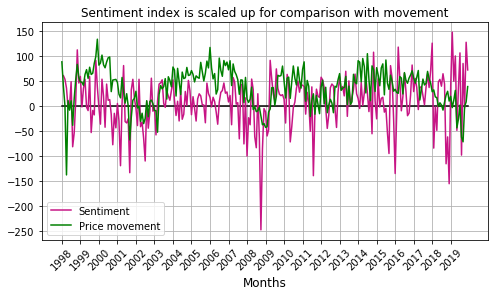

# WSJ_headlines_SP500
Investigate relation between sentiment of financial headlines and S&amp;P500 price movement

# Introduction

The archive of Wall Street Journal (WSJ) headlines (and articles) since 1998 is available at:

https://www.wsj.com/news/archive/years

The sentiment index is calculated for headlines relevant to finance/stock market. The relationship between the average sentiment index and S&P's price movement is investigated for different annual and monthly time scales. Further the question is posed : Does the WSJ headline sentiment index have predictive power in so far as forecasting S&P's price movement is concerned.

Packages used :
* Beautifulsoup
* Pandas

The following shows the number of WSJ articles per year. The relevant articles are those with tags (categories) pertaining to finance/stock (eg. money, market, wealth, stock, business etc).

The tags searched for to determine relevant headlines are :
'auto','bank','barron', 'business','capital','commod', 'commerce', 'corporate', 'earning','econom', 'energy', 'estate',
'exchange' , 'executive','finance', 'fiscal', 'forex' , 'fund','gas','goldman', 'heard', 'industr', 'infra', 'insur', 'invest', 'innovation',
'logistics','market','money','oil', 'price','property', 'share', 'stock', 'street', 'tax','tech', 'telecom',
'trade','treasur','value','venture','wealth','wall','worth'

The frequency of words in the relevant headlines are counted. The bar chart and wordcloud of top few words is shown below.

   

VADER (Valence Aware Dictionary and sEntiment Reasoner) Sentiment analyser is used to calculate the sentiment score for each headline. The bar chart of annually averaged sentiment index is shown below.

The following shows S&P500 index over same time period (1998-2020). Comparing the above sentiment index bar chart to the following figure it is clear that the negative sentiment in years 2002 and 2008 correlates strongly with the price drop around the same point in time.

   

The time varying S&P500 price is converted to price movement (i.e. gradient). The price movement is quantified by subtracting consecutive closing prices. The first entry corresponds to 1999 which is given by price(1999)-price(1998). The last entry corresponds to 2019 which is given by price(2019)-price(2018). 
There exists a strong correlation between the sentiment index and the price movement. However this correlation is between the sentiment and price of the same year. The key question is : **Does the sentiment index of a particular year correctly predict the movement for the next year ?** One of the important predictions traders are interested in is whether the price increases or decreases in the future. They are also interested in the price in the future but minimally they are interested in knowing the movement which helps them to decide whether to go short or long in the stock. Apart from the sign of the gradient it is important to predict the magnitude of the gradient too. The models in this work predict the sign of the gradient (which though basic is a non-trivial problem). Further backtrading is used to check which prediction model performs the best.

 

I have setup a baseline prediction model which uses only the timeseries of movement. This baseline model uses persistence - the prediction is simply the current value. The persistence model for all its simplicity is very powerful in many timeseries prediction problems. A total number of 20 predictions are possible (2000-2019). The prediction for 2000 is +ve price movements since the sign of 1999 price movement is +ve. The value of 1999 price movement is +241.9. The prediction model only uses the sign. The prediction for 2000 turns out to be true. The baseline model prediction for 2001 turns out to be false.

The sentiment model uses the sentiment index for year N to predict the movement for year N+1. If the sentiment is -ve (+ve) for year N then the prediciton is -ve movement (+ve movement) for the year N+1. The following table summarizes the results. The sentiment model has a marginal advantage over the baseline model. The sentiment model correctly predicts one year for which the baseline model fails. This year happens to be 2010.

Confusion matrices :

|Baseline |     |Pred|Pred |    | 
|:-------:|:---:|:--:|:--:|:--:|
|         |     | UP |DOWN|TOT | 
|**TRUE** |UP   | 13 |  2 |15  |
|**TRUE** |DOWN |  2 |  3 | 5  |

|Sentiment|     |Pred|Pred|    | 
|:-------:|:---:|:--:|:--:|:--:|
|         |     | UP |DOWN|TOT | 
|**TRUE** |UP   | 15 |  0 |15  |
|**TRUE** |DOWN |  3 |  2 | 5  |

## Backtrading (Annual timescale)

I have used a basic trading algorithm. The trading starts in 1999. The first prediction is for year 2000. The last trade is in 2018 based on the prediction for 2019. In 2019 the stocks (if any) are sold and converted to cash. The first trade (1999) is either buying one stock of S&P500 or holding cash equivalent of one stock depending on if the prediction is positive price movement (UP) or negative price movement (DOWN). At any given year, for a given model if the prediction is UP for next year all cash is converted to stock. At any given year, for a given model if the prediction is DOWN for next year all stock is converted to cash. However, if the prediction of the model is the same as the last year, the positions are held. For example if the prediction is UP for a given year and if last year the prediction was also UP, then the stocks bought last year are held. The initial investment for all models is the price of stock in 1999. This investment is $1327.3. The closing price in 2019 is $2913.4.

The following models are used :
* Sentiment : It uses the current sentiment index to predict the next year.
* Baseline :  It uses the current movement as the prediction. It is also known as peristence.
* Perfect  :  This is a hypothetical model. It correctly predicts all the movements.
* Imperfect : This is a hypothetical model. It incorrectly predicts all the movements.
* UP model : It predicts all movements as UP.
* DW model : It predicts all movements as DOWN.

|                     | sentiment |Baseline|Perfect | Imperfect | UP model | DW model |
|:-------------------:|:---------:|:------:|:------:|:---------:|:--------:|:--------:|
|**Cash   (USD)**     | 3860      |  3293  | 6712   | 576       | 2913     | 1327     |
|**Net Profit (USD)** | 2533      |  1965  | 5384   | -751      | 1586     | 0        |
|**%Net Profit**      |  190      |  148   | 405    | -56       |  119     | 0        |

# Monthly timescale

   

The accuracy of sentiment model is 0.62 and that of persistence model is 0.60.

Confusion matrices :

|Baseline |     |Pred|Pred  |    | Baseline |     |Pred|Pred  |    |
|:-------:|:---:|:--:|:----:|:--:| :-------:|:---:|:--:|:----:|:--:|
|         |     | UP  |DOWN |TOT |          |     | UP  |DOWN |TOT |
|**TRUE** |UP   | 110 |  52 |162 | **TRUE** |UP   | 110 |  52 |162 |
|**TRUE** |DOWN |  52 |  48 | 100| **TRUE** |DOWN |  52 |  48 | 100|

|Sentiment|     |Pred |Pred |    | 
|:-------:|:---:|:---:|:---:|:--:|
|         |     | UP  |DOWN |TOT | 
|**TRUE** |UP   | 142 | 20  |162 |
|**TRUE** |DOWN |  79 | 21  |100 |

# Further work

* Collect archived news headlines from other sources which are relevant to S&P500
* Rather than considering only the headline, process the whole article and flesh out sentences relevant to S&P500.

# References
https://towardsdatascience.com/stock-news-sentiment-analysis-with-python-193d4b4378d4

https://towardsdatascience.com/sentiment-analysis-of-stocks-from-financial-news-using-python-82ebdcefb638

https://medium.com/analytics-vidhya/simplifying-social-media-sentiment-analysis-using-vader-in-python-f9e6ec6fc52f

Hutto, C.J. & Gilbert, E.E. (2014). VADER: A Parsimonious Rule-based Model for Sentiment Analysis of Social Media Text. Eighth International Conference on Weblogs and Social Media (ICWSM-14). Ann Arbor, MI, June 2014.
