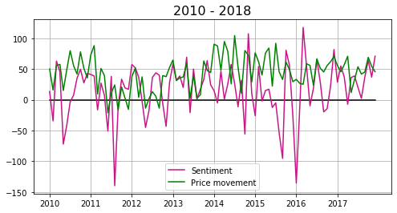

# WSJ_headlines_SP500
Investigate the predictive power of sentiment of Wall Street Journal financial headlines with respect to  S&amp;P500 price movement.

# Introduction

The archive of Wall Street Journal (WSJ) headlines (and articles) since 1998 is available at:

https://www.wsj.com/news/archive/years

I scraped these along with their category tag and datetime stamps. I downloaded S&P500's (ticker symbol ^GSPC) stock price timeseries from 2000-2019.
The sentiment index is calculated for headlines relevant to finance/stock market. The relationship between the average sentiment index and S&P's price movement is investigated for different annual and monthly time scales. Further the question is posed : Does the WSJ headline sentiment index have predictive power in so far as forecasting S&P's price movement is concerned.

The S&P500 data is downloaded from :
https://finance.yahoo.com/quote/%5EGSPC?p=^GSPC&.tsrc=fin-srch

Packages used :
* Beautifulsoup
* Pandas

The following shows the number of WSJ articles per year. The relevant articles are those with tags (categories) pertaining to finance/stock (eg. money, market, wealth, stock, business etc).

The tags searched for to determine relevant headlines are :
'auto','bank','barron', 'business','capital','commod', 'commerce', 'corporate', 'earning','econom', 'energy', 'estate',
'exchange' , 'executive','finance', 'fiscal', 'forex' , 'fund','gas','goldman', 'heard', 'industr', 'infra', 'insur', 'invest', 'innovation',
'logistics','market','money','oil', 'price','property', 'share', 'stock', 'street', 'tax','tech', 'telecom',
'trade','treasur','value','venture','wealth','wall','worth'

 
 
 
 
 
 
The frequency of words in the relevant headlines are counted. The bar chart and wordcloud of top few words is shown below.

 

# Annual timescale

VADER (Valence Aware Dictionary and sEntiment Reasoner) Sentiment analyser is used to calculate the sentiment score for each headline. 
The bar chart of annually averaged sentiment index is shown below.

The following shows S&P500 index over same time period (1998-2020). Comparing the above sentiment index bar chart to the following figure it is clear that the negative sentiment in years 2002 and 2008 correlates strongly with the price drop around the same point in time.

   

The time varying S&P500 price is converted to price movement (i.e. gradient). The price movement is quantified by subtracting consecutive closing prices. The first entry corresponds to 1999 which is given by price(1999)-price(1998). The last entry corresponds to 2019 which is given by price(2019)-price(2018). 
There exists a strong correlation between the sentiment index and the price movement. However this correlation is between the sentiment and price of the same year. The key question is : **Does the sentiment index of a particular year correctly predict the movement for the next year ?** One of the important predictions traders are interested in is whether the price increases or decreases in the future. They are also interested in the price in the future but minimally they are interested in knowing the movement which helps them to decide whether to go short or long in the stock. Apart from the sign of the gradient it is important to predict the magnitude of the gradient too. The models in this work predicts the sign of the gradient (which though basic is a non-trivial problem). Further, a *gradient metric* and *backtrading* is used to verify if the model predicted sign, on an average, gives good performance in terms of the magnitude of the movement. A better hit rate in terms of predicting the movements need not translate into a better performance in terms of profit accrued. This is because the correctly predicted movements (by particular model) could have small magnitude movements. On the other hand, another model could have fewer number of correctly predicted movements but with associated higher magnitude of movements.

I have setup a baseline prediction model which uses only the timeseries of movement. This baseline model uses persistence - the prediction is simply the current value. This model is closely related to momentum based trading strategies. The persistence model for all its simplicity is very powerful in many timeseries prediction problems. A total number of 20 predictions are possible (2000-2019). The prediction for 2000 is a +ve price movement since the sign of 1999 price movement is +ve. The value of 1999 price movement is +241.9. The prediction model only uses the sign. The prediction for 2000 turns out to be true. The baseline model prediction for 2001 turns out to be false.

The sentiment model uses the sentiment index for year N to predict the movement for year N+1. If the sentiment is -ve (+ve) for year N then the prediciton is -ve movement (+ve movement) for the year N+1. The following table summarizes the results. The sentiment model has a marginal advantage over the baseline model. The sentiment model correctly predicts one year for which the baseline model fails. This year happens to be 2010. The accuracy of sentiment model is 0.85. The accuracy of baseline model is 0.80.

Confusion matrices :

|**Baseline** |     |Pred    |Pred     |     |      |**Sentiment**|     |Pred    |Pred    |    | 
|:-----------:|:---:|:------:|:-------:|:---:|------|:-----------:|:---:|:------:|:------:|:--:|
|             |     | UP     |DOWN     |TOT  |      |             |     | UP     |DOWN    |TOT | 
|**TRUE**     |UP   | **13** |  **2**  |15   |      |**TRUE**     |UP   | **15** |  **0** |15  |
|**TRUE**     |DOWN |  **2** |  **3**  | 5   |      |**TRUE**     |DOWN |  **3** |  **2** | 5  |

The sentiment model incorrectly predicts 3 downs as ups. The persistence model incorrectly predicts 2 ups and 2 downs. The following figures shows these misses. Both the models
make wrong predictions about the downward movement in 2001 and 2008. The sentiment model incorrectly predicts the downward movement of 2002 as upward whose magnitude is -200 USD. The persistence model makes wrong prediction about 2004 and 2010 whose magnitudes are 165 and 191 USD. A metric is calculated which takes into account both the sign and magnitude of the predicted movement. This metric is named the *gradient metric*. For a given model, the gradient metric is calculated as follows. For each correct prediction the absolute value of the movement is added while for a wrong prediction the absolute value is subtracted. The gradient metric for the sentiment and the persistence model is $2187 and $1873. However the gradient metric does not include information about the timing of the right/wrong prediction. If for a particular model all the wrong predictions are concentrated at the begining of the trading (between say 2000 and 2005) it will generate much worse returns than if they were concentrated towards the end, all other things being equal. This is because of the compounding effect. The best way to quantify  the performance of any model is backtrading. It includes the effect of the sign of movement, its magnitude and its timing.

## Backtrading (Annual timescale)

I have used a basic trading algorithm. The trading starts in 1999. The first prediction is for year 2000. The last trade is in 2018 based on the prediction for 2019. In 2019 the stocks (if any) are sold and converted to cash. The first trade (1999) is either buying one stock of S&P500 or holding cash equivalent of one stock depending on if the prediction is positive price movement (UP) or negative price movement (DOWN). At any given year, for a given model if the prediction is UP for next year all cash is converted to stock. At any given year, for a given model if the prediction is DOWN for next year all stock is converted to cash. However, if the prediction of the model is the same as the last year, the positions are held. For example if the prediction is UP for a given year and if last year the prediction was also UP, then the stocks bought last year are held. The initial investment for all models is the price of stock in 1999. This investment is $1327.3. The closing price in 2019 is $2913.4. 

The following models are used :
* **Sentiment** : It uses the current sentiment index to predict the next year.
* **Baseline** :  It uses the current movement as the prediction. It is also known as peristence.
* **Perfect**  :  This is a hypothetical model. It correctly predicts all the movements.
* **Imperfect** : This is a hypothetical model. It incorrectly predicts all the movements.
* **UP model** : It predicts all movements as UP (This model buys stock in 1999 and holds it till 2019).
* **DW model** : It predicts all movements as DOWN (This model never buys any stock !).

Following table summarizes the performance of the models. Transaction costs are ignored in calculating the profit.

|                     | *sentiment* |*Baseline*|Perfect | Imperfect | UP model | DW model |
|:-------------------:|:-----------:|:--------:|:------:|:---------:|:--------:|:--------:|
|**Cash   (USD)**     | 3860        |  3293    | 6712   | 576       | 2913     | 1327     |
|**Net Profit (USD)** | 2533        |  1965    | 5384   | -751      | 1586     | 0        |
|**% Net Profit**     |  190        |  148     | 405    | -56       |  119     | 0        |

The sentiment model outperforms the baseline (persistence) model by about 42% in net profit. The perfect model performs the best by design. The buy and hold model returns 119%.

# Monthly timescale

The monthly timescale prediction follows the same stencile as that of the annual timescale. The only difference is that the monthly averaged sentiment is used to predict the next month's closing price. The persistence model uses the current movement to predict the next month's movement. The first prediction is for March 1998. There are a total of 262 predictions. The following figures show the temporal evolution of the monthly averaged sentiment and movement.

The accuracy of sentiment model is 0.62 and that of persistence model is 0.60. The confusion matrices are,

|**Baseline** |     |Pred     |Pred      |    |    |**Sentiment** |     |Pred     |Pred     |     |
|:-----------:|:---:|:-------:|:--------:|:--:|:--:|:------------:|:---:|:-------:|:-------:|:---:|
|             |     | UP      |DOWN      |TOT |    |              |     | UP      |DOWN     | TOT |
|**TRUE**     |UP   | **110** |  **52**  |162 |    |**TRUE**      |UP   | **142** |  **20** |162  |
|**TRUE**     |DOWN |  **52** |  **48**  | 100|    |**TRUE**      |DOWN |  **79** |  **21** | 100 |

The sentiment model is better at predicting upwards movement (142/162) compared to the persistence model (110/162). The sentiment model is worse at predicting downward movements (21/100). This is clearly seen in the following figures which shows movements corresponding to wrong predictions by each of the two models. Note that for the persistence model large magnitude wrong predictions occur earlier (1998-1999) than for the sentiment model. Because of the compounding effect this adversely impact the return of the persistence model. The peristence model produces an equal number of wrong predictions for the two categories which results in a symmetric distribution of blue crosses around the zero line. On the other hand the sentiment model produces far more wrong predictions when the actual movement is downwards. From the confusion matrix it is clear that out of 100 actual downward movements, it (wrongly) classifies 79 !

The gradient metric is 2486 and 2563 for the sentiment and the persistence model respectively. Though the persistence model is better according to the gradient model, the sentiment model wins in backtrading. This is most probably because of the time distribution of the wrong predictions as shown above. The large magnitude errors for the persistence model occur earlier (1998-1999). In the period from 2010-2018 the sentiment model performs particularly bad. It incorrectly predicts most of the downward movements during this period because the sentiment index tends to be positive for most of this period.
The following table summarizes the performance of the models in backtrading. Transaction costs are ignored in calculating the profit. The initial investment is $1023.7 which is the price of the stock in February 1998.

 
 
 

|                     | *sentiment* |*Baseline*|Perfect | Imperfect | UP model | DW model |
|:-------------------:|:-----------:|:--------:|:------:|:---------:|:--------:|:--------:|
|**Cash   (USD)**     | 4986        |  4700    | 67873  | 47        | 3176     | 1023     |
|**Net Profit (USD)** | 3962        |  3676    | 66849  | -975      | 2153     | 0        |
|**% Net Profit**     |  387        |  359     | 6529   | -95       | 210      | 0        |

The sentiment model outperforms the baseline (persistence) model by about 28% in net profit. The perfect model performs the best by design. The buy and hold model returns 210%.
Comparing the monthly and annual timescale trading, though the accuracy of both the models has decreased from about 0.8 to 0.6 the net profit has increased by 1.56 for the sentiment model and by 1.87 for the baseline model.

# Conclusion and further work

The sentiment based prediction is better than the baseline (momentum) based model on both monthly and annual timescales. The sentiment based model outperforms the baseline model by 28% and 42% in backtrading on the monthly and annual timescale respectively.

* Collect archived news headlines from other sources which are relevant to S&P500
* Rather than considering only the headline, process the whole article and flesh out sentences relevant to S&P500.
* Trace back the average negative (eg. 2002, 2008) and positive (2000, 2005, 2014) sentiments to particular news articles and ask the question - is this just luck or the headline had something to do with S&P500 ?
* Predict and backtrade on daily timescale. I anticipate a further drop in accuracy compared to the monthly timescale.
* Use another sentiment model (eg. FinBERT) - are the results consistent with those obtained ?
* The methods give_articles_nextpages() and give_articles() in wsj_scrape_requests2.ipynb can be merged to make the code shorter.

# References
https://towardsdatascience.com/stock-news-sentiment-analysis-with-python-193d4b4378d4

https://towardsdatascience.com/sentiment-analysis-of-stocks-from-financial-news-using-python-82ebdcefb638

https://medium.com/analytics-vidhya/simplifying-social-media-sentiment-analysis-using-vader-in-python-f9e6ec6fc52f

Hutto, C.J. & Gilbert, E.E. (2014). VADER: A Parsimonious Rule-based Model for Sentiment Analysis of Social Media Text. Eighth International Conference on Weblogs and Social Media (ICWSM-14). Ann Arbor, MI, June 2014.
